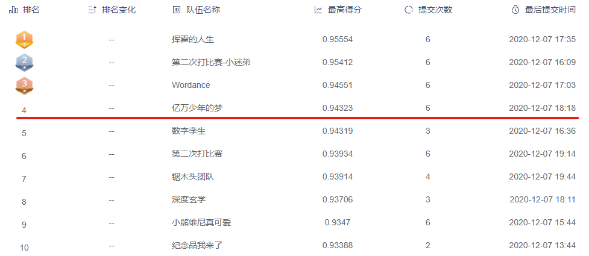

# [OneCity-2020](https://www.dcjingsai.com/v2/cmptDetail.html?id=457)



## 1. 任务

选手需要建立模型，针对政务表格文件实现自动化分类。允许使用一些常见的开源预训练模型，如bert。

数据智能分类按照行业领域，将政务数据分为以下20个基础大类，分别是：生态环境、资源能源、信息产业、医疗卫生、文化休闲、财税金融、经济管理、教育科技、交通运输、工业、农业畜牧业、政法监察、城乡建设、商业贸易、旅游服务、气象水文测绘地震地理、外交外事、文秘行政、民政社区、劳动人事。

## 2. 数据

数据是从政府开放数据平台收集的真实数据，共有9万多个表格文件，包括xls、xlsx、csv三种格式，其中csv文件编码格式统一为utf-8。 

文件被分为三个部分，训练集、测试集1和测试集2。其中训练集（6万个文件，含标签）和测试集1（8000个文件，不含标签）于初赛阶段开放给选手下载，测试集2（不含标签）于复赛阶段开放给选手下载。

* 注意1：有些文件的内容为空。
* 注意2：有些文件的扩展名与文件格式不匹配，比如有些扩展名为xls的文件实际上是csv文件，有些扩展名为csv的文件其实是html文件。
* 注意3：在复赛阶段，有约50%的文件名会被更名为纯数字（这些文件的内容非空），请选手注意调整模型。

## 3. 硬件

CPU： Intel(R) Xeon(R) Gold 5118 CPU @ 2.30GHz

GPU：Tesla V100

## 4. 评分标准

准确率Accuracy

## 5. 目录结构
```
.
├── data (原始数据)
│   ├── train/
│   ├── test1/
│   ├── test2/
│   ├── answer_train.csv
│   ├── submit_example_test1.csv
│   ├── submit_example_test2.csv
│   ├── zhongyi_preliminary.zip
│   └── zhongyi.zip
├── roberta_wwm (预训练模型)
│   ├── config.json
│   ├── pytorch_model.bin
│   └── vocab.txt
├── src (源代码)
│   ├── preprocess.py (数据预处理)
│   ├── run_bert.py (Bert训练)
│   ├── run_cnn.py (TextCNN训练)
│   ├── run_mlp.py (MLP训练)
│   └── run_stacking.py (模型融合)
├── picture
├── run.sh (执行脚本)
└── README.md 
```

## 6. 环境
* Ubuntu 16.04, V100, RAM 128G
* CUDA 10.1, CUDNN 7.6.4
* pandarallel 1.5.1
* pandas 1.0.5
* xlrd 1.2.0
* pkuseg 0.0.25
* scikit-learn 0.23.1
* tqdm 4.46.1
* pytorch 1.4.0
* transformers 3.5.1
* gensim 3.8.3

## 7.运行

1. [下载](https://huggingface.co/hfl/chinese-roberta-wwm-ext)预训练好的 Bert 模型权重并解压在 roberta_wwm 文件目录下。
2. 准备好官网提供的数据集，unzip -O CP936 解压在 data 目录下，并将数据整理为如上所示结构。
3. 执行脚本。
```
bash run.sh
```


## 8. 参考资料

* https://github.com/chenyuntc/PyTorchText/
* https://github.com/ymcui/Chinese-BERT-wwm
* https://huggingface.co/hfl/chinese-roberta-wwm-ext